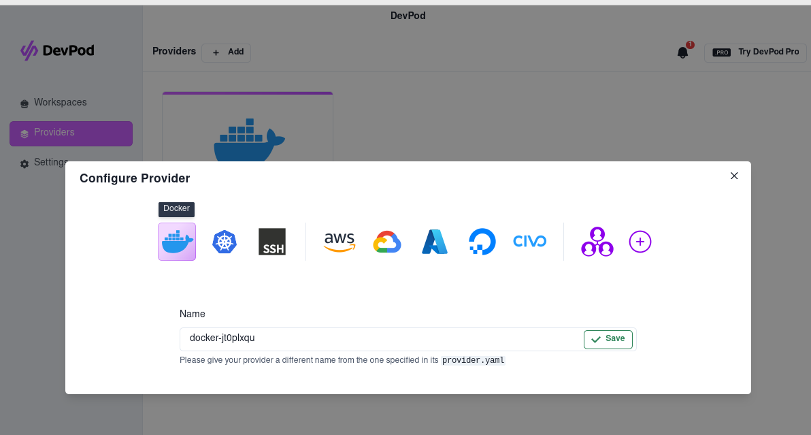
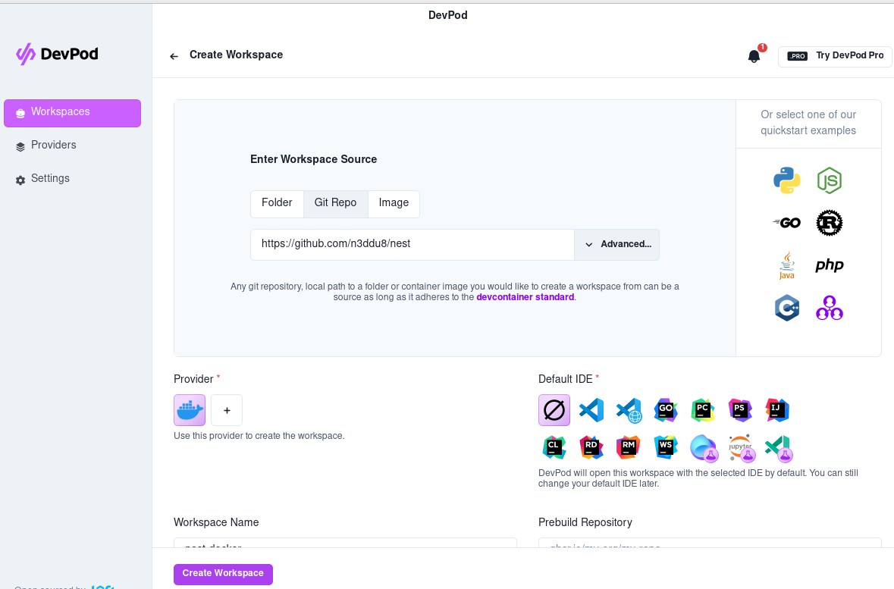

<!-- Improved compatibility of back to top link: See: https://github.com/othneildrew/Best-README-Template/pull/73 -->
<a name="readme-top"></a>
<!--
*** Thanks for checking out the Best-README-Template. If you have a suggestion
*** that would make this better, please fork the repo and create a pull request
*** or simply open an issue with the tag "enhancement".
*** Don't forget to give the project a star!
*** Thanks again! Now go create something AMAZING! :D
-->


<!-- PROJECT SHIELDS -->
<!--
*** I'm using markdown "reference style" links for readability.
*** Reference links are enclosed in brackets [ ] instead of parentheses ( ).
*** See the bottom of this document for the declaration of the reference variables
*** for contributors-url, forks-url, etc. This is an optional, concise syntax you may use.
*** https://www.markdownguide.org/basic-syntax/#reference-style-links
-->
[![Contributors][contributors-shield]][contributors-url]
[![Forks][forks-shield]][forks-url]
[![Stargazers][stars-shield]][stars-url]
[![Issues][issues-shield]][issues-url]
[![MIT License][license-shield]][license-url]


<!-- PROJECT LOGO -->
<br />
<div align="center">
  <a href="https://github.com/n3ddu8/nest">
    
  </a>

<h3 align="center">nest</h3>

  <p align="center">
    My Alpine based custom development environment.
    <br />
    <br />
    <a href="https://github.com/n3ddu8/nest/issues/new?labels=bug&template=bug-report---.md">Report Bug</a>
    ·
    <a href="https://github.com/n3ddu8/nest/issues/new?labels=enhancement&template=feature-request---.md">Request Feature</a>
  </p>
</div>


<!-- TABLE OF CONTENTS -->
<details>
  <summary>Table of Contents</summary>
  <ol>
    <li>
      <a href="#about-the-project">About The Project</a>
      <ul>
        <li><a href="#why-alpine">Why Alpine</a></li>
        <li><a href="#built-with">Built With</a></li>
        <li><a href="#packages">Packages</a></li>
      </ul>
    </li>
    <li>
      <a href="#getting-started">Getting Started</a>
      <ul>
        <li><a href="#using-just">Using Just</a></li>
      </ul>
    </li>
    <li><a href="#contributing">Contributing</a></li>
    <li><a href="#license">License</a></li>
    <li><a href="#acknowledgments">Acknowledgments</a></li>
  </ol>
</details>


<!-- ABOUT THE PROJECT -->
## About The Project

Nest is my custom development environment, built on top of [Alpine Base](alpine-base), containing the tools I use regularly in my work as a Data Engineer or when working on my own open-source projects.

It's designed to be used in a variety of ways:
* In a new environment, using the Just command runner and the included `.justfile`.
* Using DevPod or Codespaces, by pointing at this repo.
* ~As the upstream for a new container, using the published package.~ *coming soon*

### Why Alpine

Alpine is a minimalist distribution, the official Docker image is just 5MB in size making it the perfect base to build upon.

<p align="right">(<a href="#readme-top">back to top</a>)</p>

### Built With

* [Just](https://just.systems/)
* [Docker](https://www.docker.com/)
* [Devcontainer](https://code.visualstudio.com/docs/devcontainers/create-dev-container)


<p align="right">(<a href="#readme-top">back to top</a>)</p>

### Packages

#### Upstream

The [Alpine Base](alpine-base) image contains some basic tooling:
* curl
* Python3
* Pip for Python3
* Microsoft ODBC driver 17 for working with SQL Server
* Misc packages required to work with:
    * Sqlite
    * MySQL
    * MariaDB
    * PostgreSQL
 
#### Additions

Additional packages added are:
* github-cli
* neovim
* npm
* openssh
* tmux
* zsh

<p align="right">(<a href="#readme-top">back to top</a>)</p>


<!-- GETTING STARTED -->
## Getting Started

### Using Just

The `.justfile` works in an Alpine Linux environment only.

#### Prerequisites

* just
  * `apk add just`
* wget
  * `apk add wget`

#### Installation

```sh
wget https://raw.githubusercontent.com/n3ddu8/nest/main/.justfile
```

#### Usage

```sh
just .
```

<p align="right">(<a href="#readme-top">back to top</a>)</p>

### Using DevPod

#### Prerequisites

* Docker
  * [Docker Installation Instructions](https://docs.docker.com/engine/install/)
* DevPod
  * [DevPod Installation Instructions](https://devpod.sh/docs/getting-started/install)
* VSCode (optional)
  * [Download VSCode](https://code.visualstudio.com/download)
  * Install using your local 
 
#### devpod-cli setup

Add Docker as a provider:
```sh
devpod provider add docker
```

Run the following:
```sh
devpod up github.com/n3ddu8/nest --ide <ide>
```
replacing `<ide>` with one of:
* vscode
* openvscode (to launch in a browser)
* none

#### DevPod (GUI) setup

Click on `Providers`, `+ Add` and choose `Docker`:

<div align="left">
  
</div>
</br>

* Click on `Workspaces`, `+ Create`
* In the `Git Repo` box enter `github.com/n3ddu8/nest`
* Choose a `Default IDE` or leave as `None`
* Click `Create Workspace`

<div align="left">
  
</div>
</br>

##### Installation

#### Usage

If using `--ide vscode` VS Code should now launch, similarly using `--ide openvscode` your browser should launch. As a NeoVim user neither of these options have been tested, but there shouldn't be any reason they don't work.

If using `--ide none`, you can access the container by running:
```sh
ssh nest.devpod
```

<p align="right">(<a href="#readme-top">back to top</a>)</p>


<!-- CONTRIBUTING -->
## Contributing

Contributions are what make the open source community such an amazing place to learn, inspire, and create. Any contributions you make are **greatly appreciated**.

That being said, this is my personalised development environment, and what works best for me will always being the primary factor in the decision to merge any changes.

If you have a suggestion that would make this better, please fork the repo and create a pull request. You can also simply open an issue with the tag "enhancement".
Don't forget to give the project a star! Thanks again!

1. Fork the Project
2. Create your Feature Branch (`git checkout -b feature/AmazingFeature`)
3. Commit your Changes (`git commit -m 'Add some AmazingFeature'`)
4. Push to the Branch (`git push origin feature/AmazingFeature`)
5. Open a Pull Request

<p align="right">(<a href="#readme-top">back to top</a>)</p>


<!-- LICENSE -->
## License

Distributed under the MIT License. See `LICENSE.txt` for more information.

<p align="right">(<a href="#readme-top">back to top</a>)</p>


<!-- ACKNOWLEDGMENTS -->
## Acknowledgments

* [Nest icons created by Freepik - Flaticon](https://www.flaticon.com/free-icons/nest)

<p align="right">(<a href="#readme-top">back to top</a>)</p>


<!-- MARKDOWN LINKS & IMAGES -->
<!-- https://www.markdownguide.org/basic-syntax/#reference-style-links -->
[contributors-shield]: https://img.shields.io/github/contributors/n3ddu8/nest.svg?style=for-the-badge
[contributors-url]: https://github.com/n3ddu8/nest/graphs/contributors
[forks-shield]: https://img.shields.io/github/forks/n3ddu8/nest.svg?style=for-the-badge
[forks-url]: https://github.com/n3ddu8/nest/network/members
[stars-shield]: https://img.shields.io/github/stars/n3ddu8/nest.svg?style=for-the-badge
[stars-url]: https://github.com/n3ddu8/nest/stargazers
[issues-shield]: https://img.shields.io/github/issues/n3ddu8/nest.svg?style=for-the-badge
[issues-url]: https://github.com/n3ddu8/nest/issues
[license-shield]: https://img.shields.io/github/license/n3ddu8/nest.svg?style=for-the-badge
[license-url]: https://github.com/n3ddu8/nest/blob/master/LICENSE.txt
[alpine-base]: https://github.com/n3ddu8/alpine-base
